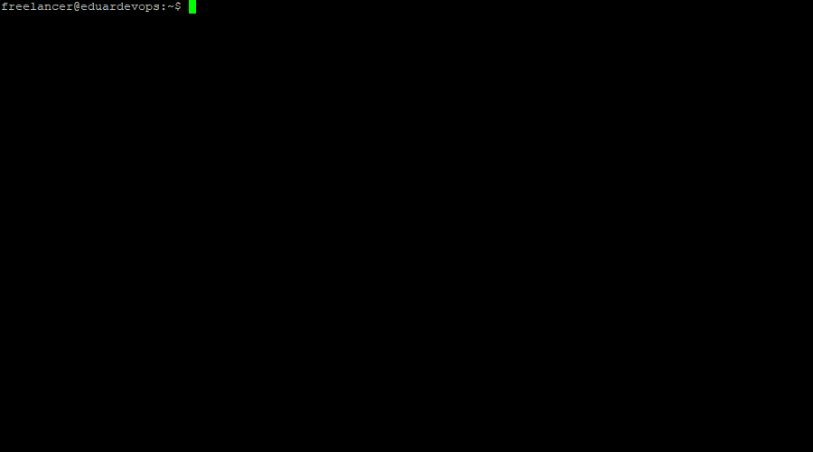
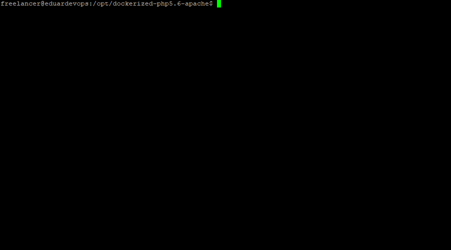

<!-- ## Dockerized PHP v5.6 Apache2 v2.4 MySQL v5.7 Redis v5.0 -->
 


------

# INFO!!!
####  Still working on this. All necessary comments will be provided at the very end
####  Don't use this

------
## First things first
Before you can use this repo make sure you have [Docker](https://www.docker.com/) and [Docker Compose](https://docs.docker.com/compose/install/) installed


## Components Versions
*	PHP v5.6.40
*	Nginx v1.10.3
*	MySQL v5.7.26
*	Redis v5.0.5
------
## Content
The list doesn't contain git generated files and repo assets (e.g. README.md, logo.jpg)

### Tree

```bash
.
├── .env.db
├── .env.web
├── Dockerfile
├── backup
│   ├── db_backup.sh
│   ├── db_restore.sh
│   ├── web_backup.sh
│   └── web_restore.sh
├── conf
│   ├── apache-reverse-proxy.conf
│   ├── apache2.conf
│   ├── httpd.conf
│   ├── nginx-reverse-proxy.conf
│   └── website.conf
├── docker-compose-alter.yml
├── docker-compose.yml
└── web
    └── index.html
```

### Description
Name| Description
------------ | -------------
.env.db | MySQL Database root password. As well as new Database user and password
.env.redis | Redis container environments
Dockerfile | As it says, Dockerfile from which image will be build
apache-reverse-proxy.conf | Reverse proxy config for apache2
apache2.conf | Default apache2.conf for Debian/Ubuntu
httpd.conf | Default httpd.conf for CentOS/RHEL
nginx-reverse-proxy.conf | Reverse proxy config for nginx
website.conf | Apache vhost config file for container
db_backup.sh | BASH script for database backup
db_restore.sh | BASH script for database restore
web_backup.sh | BASH script for web folder backup
web_restore.sh | BASH script for web folder restore
docker-compose.yml  | Main file of the project that builds and links containers
docker-compose-alter.yml | Alternative config file for version 2.4 so you can set memory limits
web | A folder where you can  copy your web project (website/webapp/etc)

------
#### ToDo
All names and parameters can be, and in most cases should be edited.


#### Run
Clone repo to your server (I would suggest use /opt directory)
```bash
sudo git clone https://github.com/eduardevops/dockerized-php5.6-nginx.git
```

Make sure your user is a member of Docker group
```sh
usermod -aG docker <username>
```
Navigate to the project folder and start containers
```sh
cd /path/to/dockerized-php5.6-apache
docker-compose up -d
```

#### Animation


------
Check logs in real-time
```sh
docker-compose logs -f
```

#### Animation

